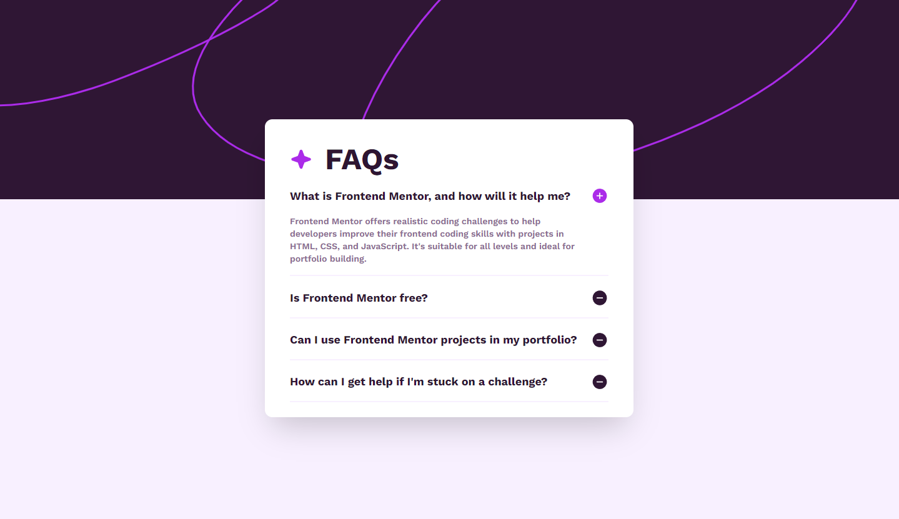
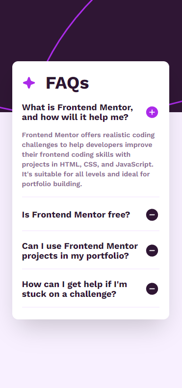

# Faq Accordion

Este é um projeto [Next.js](https://nextjs.org/) de um Faq Accordion baseado em um desafio do [FrontEnd-Mentor](https://www.frontendmentor.io/challenges/faq-accordion-wyfFdeBwBz).

## Rodando Localmente

Clone o projeto

```bash
git clone https://github.com/HigorSR/faq-accordion.git
```

Entre no diretório do projeto

```bash
  cd faq-accordion
```

Instale as dependências

```bash
  npm install
  # or
  yarn install
```

Inicie o servidor

```bash
  npm run dev
  # or
  yarn dev
```

Abra http://localhost:3000 com seu navegador para ver o resultado.

## Screenshots

<div align="center">
  
  
</div>

## Stack utilizada

**Front-end:** Next.js, Typescript, TailwindCSS
